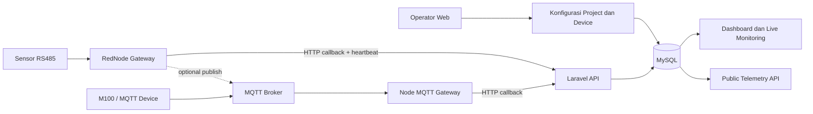

# Panduan Lengkap dan Flow Aplikasi

Dokumen ini adalah jalur onboarding utama. Setelah menyelesaikannya, Anda seharusnya dapat menjalankan aplikasi, membuat struktur project, menghubungkan Data Logger dan sensor, memulai monitoring, serta memahami data yang muncul di dashboard.

## 1. Gambaran produk

RESQ Early Warning System (EWS) menggabungkan empat kebutuhan:

1. **Master configuration** — project, wilayah, station, logger, sensor, warning station, dan response plan.
2. **Device integration** — Modbus TCP untuk pengujian, Modbus RTU/RS485 pada RedNode, atau MQTT dari logger seperti M100.
3. **Telemetry processing** — update nilai/status sensor, simpan snapshot terbaru, dan optional canonical mapping.
4. **Monitoring** — dashboard peta, monitoring per project, status logger, serta public read API.

Alur konsepnya:



## 2. Persyaratan development

### Wajib

- PHP 8.2 atau lebih baru.
- Composer 2.
- MySQL/MariaDB. Konfigurasi contoh menggunakan MySQL.
- Node.js LTS dan npm.
- Extension PHP Laravel umum: OpenSSL, PDO MySQL, Mbstring, Tokenizer, XML, Ctype, JSON, Fileinfo, dan BCMath.

### Hanya bila menguji perangkat

- Akses jaringan ke Modbus TCP device untuk backend Node `modbus-server/server.js`.
- RedNode/Bliiot Linux dengan port RS485 untuk `rednode-gateway/gateway.js`.
- MQTT broker untuk jalur M100/MQTT.
- Akses SSH dari server Laravel ke RedNode bila tombol start/stop remote akan digunakan.

## 3. Instalasi lokal langkah demi langkah

### 3.1 Pasang dependency

Linux/macOS:

```bash
composer install
npm install
cp .env.example .env
```

Windows PowerShell:

```powershell
composer install
npm install
Copy-Item .env.example .env
```

Jangan memakai folder `vendor/` atau `node_modules/` yang disalin dari mesin lain sebagai acuan. Reinstall berdasarkan lock file agar binary dan dependency native sesuai sistem operasi.

### 3.2 Buat database

Contoh MySQL:

```sql
CREATE DATABASE resq_ews CHARACTER SET utf8mb4 COLLATE utf8mb4_unicode_ci;
CREATE USER 'resq_app'@'localhost' IDENTIFIED BY 'ganti-password-kuat';
GRANT ALL PRIVILEGES ON resq_ews.* TO 'resq_app'@'localhost';
FLUSH PRIVILEGES;
```

Ubah `.env`:

```dotenv
APP_NAME="RESQ Early Warning System"
APP_ENV=local
APP_DEBUG=true
APP_URL=http://127.0.0.1:8000

DB_CONNECTION=mysql
DB_HOST=127.0.0.1
DB_PORT=3306
DB_DATABASE=resq_ews
DB_USERNAME=resq_app
DB_PASSWORD=ganti-password-kuat
```

File `database/database.sqlite` ada di repository, tetapi MySQL adalah jalur konfigurasi bawaan. Jangan berpindah ke SQLite untuk production tanpa menguji seluruh migrasi dan query JSON.

### 3.3 Inisialisasi Laravel

```bash
php artisan key:generate
php artisan migrate --seed
php artisan storage:link
```

Seeder membuat:

- akun admin development;
- sample customers;
- master canonical parameter meteorology, hydrology, dan geotechnical.

Kredensial development:

```text
Email    : sentinaladmin@resq.com
Password : 12345678
```

Segera ganti password. Kredensial ini tertulis di `AdminUserSeeder` dan tidak layak untuk production.

### 3.4 Build frontend

Untuk development dengan watch/hot reload:

```bash
npm run dev
```

Untuk aset statis production atau pemeriksaan build:

```bash
npm run build
```

Vite mengompilasi SCSS dan menyalin JavaScript, font, image, JSON, serta library vendor dari `resources/` ke `public/build/`.

### 3.5 Jalankan web

```bash
php artisan serve --host=127.0.0.1 --port=8000
```

Buka `http://127.0.0.1:8000`, login, lalu aplikasi mengarahkan user ke `/dashboard`.

Untuk akses RedNode dari LAN, bind ke alamat yang dapat dijangkau perangkat:

```bash
php artisan serve --host=0.0.0.0 --port=8000
```

Gunakan IP LAN komputer pada `APP_URL`/URL gateway, misalnya `http://192.168.3.10:8000`. Pastikan firewall hanya membuka akses pada jaringan yang memang diperlukan.

## 4. Proses runtime dan kapan dijalankan

Web Laravel tidak otomatis menjalankan backend Node atau gateway perangkat.

| Perintah | Lokasi proses | Gunakan ketika |
|---|---|---|
| `php artisan serve` | Server aplikasi | Selalu pada development |
| `npm run dev` | Server frontend | Sedang mengubah SCSS/asset |
| `npm run modbus:server` | Laptop/server aplikasi | Menguji Modbus TCP dari halaman web atau menjadi MQTT subscriber |
| `npm run mqtt:gateway` | Laptop/VPS aplikasi | Subscribe broker MQTT dan push ke Laravel |
| `npm run gateway` | Mesin yang punya serial port | Menjalankan gateway RS485 versi `modbus-server/gateway.js` |
| `npm run rednode:gateway` | RedNode/Bliiot | Menjalankan gateway utama dengan device identity/discovery |

Pada production normal:

- Laravel berjalan melalui Nginx/Apache + PHP-FPM;
- MQTT gateway, bila dipakai, berjalan sebagai service terpisah;
- RedNode gateway berjalan di setiap perangkat lapangan;
- `npm run dev` dan `php artisan serve` tidak dipakai.

## 5. Flow penggunaan aplikasi langkah demi langkah

Urutan berikut mengikuti dependency database. Melewati urutan dapat menyebabkan dropdown kosong atau gateway tidak menemukan sensor.

### Langkah 1 — Login dan cek dashboard

Masuk melalui `/login`. Route dashboard dan mayoritas konfigurasi berada di middleware `auth`.

Dashboard menampilkan:

- jumlah project, workspace, monitoring station, warning station, sensor, dan provinsi;
- coverage per provinsi;
- marker workspace, sensor, dan warning station;
- indikator bahaya berdasarkan status atau nilai yang melampaui threshold.

Jika tabel `resq_projects` belum ada, dashboard sengaja memakai dummy data dari `config/resq_dummy.php`. Dummy dashboard bukan bukti bahwa migrasi/database sudah benar. Selalu cek `php artisan migrate:status`.

### Langkah 2 — Buat Project

Buka **Configuration → Project Setup → Project**.

Isi:

- `project_code`: identifier unik dan stabil, misalnya `PRJ-FLOOD-JKT`;
- `name`, `owner`, tanggal project;
- `status`, biasanya `Active`.

Submit ke `POST /projects`. Controller menggunakan `updateOrCreate` berdasarkan `project_code`, sehingga mengirim code yang sama memperbarui record.

### Langkah 3 — Buat Geospatial Workspace

Masuk tab **Geospatial**.

Workspace adalah cluster/lokasi hazard di bawah project. Isi:

- project induk;
- `workspace_code`, misalnya `WS-JKT-UTARA`;
- hazard, provinsi, kota, beneficiaries;
- latitude dan longitude bila tersedia;
- status awal.

Jika koordinat kosong, controller mencoba mengambil koordinat provinsi dari tabel `provinces`. Untuk marker yang presisi, isi koordinat workspace/station sendiri.

### Langkah 4 — Buat Monitoring Station

Masuk tab **Monitoring Station**.

Pilih workspace lalu isi `station_code`, nama, koordinat, serta status. Kolom string lama `logger_id` pada monitoring station masih ada untuk kompatibilitas, tetapi relasi aktif menggunakan tabel `data_loggers.monitoring_station_id`.

Gunakan koordinat `latitude, longitude` yang valid. Controller juga dapat memecah field teks `coordinate` menjadi dua angka.

### Langkah 5 — Buat Warning Station

Masuk tab **Warning Station**.

Pilih workspace dan optional source monitoring station. Isi kode station, zona, koordinat, controller, output device, status, dan `public_warning_enabled`.

Perlu dipahami: record warning station dan response plan dapat dikonfigurasi, tetapi repository belum menunjukkan job/service aktif untuk benar-benar mengirim SMS atau menyalakan sirene secara otomatis ketika threshold terlewati. Jangan menganggap checkbox tersebut sudah menjadi safety automation.

### Langkah 6 — Buat Prefix Sensor

Buka **Device Setup → Prefix Sensors**.

Prefix mengelompokkan alamat sensor. Kombinasi berikut dijaga agar tidak dipakai sensor lain:

```text
mst_prefix_id + slave_id + address
```

Contoh prefix: `MST-FLOOD`, `MST-WEATHER`, atau sesuai skema instalasi Anda.

### Langkah 7 — Daftarkan atau claim Data Logger

Data Logger dapat dibuat dari tab **Sensor & Data** atau halaman **Data Loggers**.

Minimal isi:

- monitoring station;
- `logger_code` unik, misalnya `DL-JKT-001`;
- model/serial/device label;
- status.

Untuk kontrol lewat SSH, isi juga:

- remote host/IP;
- SSH port dan user;
- SSH password;
- remote gateway path, default `/root/rednode-gateway`.

Password SSH memakai Eloquent encrypted cast dan bergantung pada `APP_KEY`.

Jika gateway baru belum dikenal, ia memanggil config/heartbeat dengan device identity. Aplikasi mencatatnya di **Detected Gateway Devices**. Pilih discovery tersebut saat menyimpan Data Logger untuk melakukan claim. Resolusi logger dilakukan dengan urutan umum:

1. `logger_code` eksplisit;
2. serial number/device UID yang pernah di-claim;
3. request IP yang cocok dengan `remote_host`;
4. satu-satunya logger serial aktif bila tidak ambigu.

Untuk banyak logger di balik satu public IP/NAT, gunakan `REDNODE_DEVICE_UID` atau `REDNODE_SERIAL_NUMBER`; pemilihan berdasarkan IP tidak cukup.

### Langkah 8 — Daftarkan Sensor

Masuk tab **Sensor & Data**.

Isi dependency utama:

- workspace dan monitoring station;
- Data Logger yang membaca sensor;
- optional warning station;
- prefix, Slave ID, register address;
- function code `FC01`, `FC02`, `FC03`, atau `FC04`;
- quantity dan poll interval;
- `sensor_code` unik;
- type, parameter, data type, scale, offset, unit;
- threshold/rule dan status awal.

Contoh sensor Modbus:

```text
sensor_code      = TMA-JKT-01
type             = water_level
slave_id         = 1
address          = 0
function_code    = FC03
quantity         = 2
data_type        = float32
scale_factor     = 1
offset           = 0
unit             = cm
threshold        = 100
poll_interval_ms = 1000
```

`sensor_code` adalah contract integration. Untuk MQTT, code harus sama dengan `sensor_code` pada payload atau segmen terakhir topic. Untuk RedNode, code dikirim kembali oleh config API dan digunakan pada callback/heartbeat.

Sensor `weather_station` dapat membawa banyak `weather_parameters`. Register dipetakan secara berurutan sesuai array parameter; pastikan quantity dan urutan register datasheet sama dengan urutan parameter.

### Langkah 9 — Buat Canonical Mapping bila diperlukan

Basic telemetry tetap bekerja tanpa canonical mapping. Mapping dibutuhkan bila Anda ingin menyimpan raw input, unit baku, traceability, dan canonical observation.

Buka tab **Canonical Data** atau menu **Canonical Database**:

1. Pastikan canonical parameter ada/aktif.
2. Tambahkan mapping profile untuk sensor.
3. Isi source parameter/register/function/data type.
4. Isi source unit, scale factor, offset, dan byte order.
5. Pilih canonical parameter dan value origin.
6. Set status `active`.

Hanya profile aktif terbaru yang dipakai. Formula transformasi yang benar-benar dijalankan saat ini:

```text
canonical_value = numeric(raw_value) × scale_factor + offset
```

Kolom `formula` dan `value_interpretation` tersimpan sebagai metadata; keduanya belum menjadi expression engine.

### Langkah 10 — Simpan konfigurasi serial RedNode

Buka **Device Setup → Modbus Configuration**.

Pilih Data Logger lalu isi:

- port serial (`/dev/ttyAS2`, `/dev/ttyAS3`, `/dev/ttyAS4`, atau `/dev/ttyAS5` pada mapping BL118 saat ini);
- baud rate, data bits, stop bits, parity, timeout;
- pin mapping;
- sensor yang dipantau;
- interval polling RedNode.

Data disimpan pada `connectivity_configs` dengan code `SERIAL-{LOGGER_CODE}`. Endpoint `/api/rednode/config` membaca record ini dan mengirim serial config beserta sensor terpilih ke gateway.

Gunakan **RedNode Pin Scan** atau test port sebelum production. Test menghentikan/menyentuh proses gateway remote dan membutuhkan SSH serta file utilitas pada gateway.

### Langkah 11 — Jalankan gateway

Pada RedNode:

```bash
cd /root/rednode-gateway
cp .env.example .env
npm install
npm run gateway
```

Sesuaikan `.env` perangkat. Minimal:

```dotenv
APP_URL=http://IP-SERVER:8000
REDNODE_CONFIG_URL=http://IP-SERVER:8000/api/rednode/config
REDNODE_CALLBACK_URL=http://IP-SERVER:8000/api/realtime-sensor-status
REDNODE_HEARTBEAT_URL=http://IP-SERVER:8000/api/rednode/heartbeat
REDNODE_DEVICE_UID=RN-BL118-0001
REDNODE_SERIAL_NUMBER=BL118-0001
```

Jika token Laravel diisi, token gateway harus sama.

Loop gateway melakukan:

1. ambil config dari Laravel;
2. buka port serial;
3. baca sensor yang sudah jatuh tempo;
4. decode register, scale/offset, evaluasi threshold;
5. POST telemetry;
6. optional publish MQTT;
7. POST heartbeat dan status setiap sensor;
8. refresh config berkala untuk menerima start/stop/perubahan sensor.

### Langkah 12 — Start Monitoring

Buka menu **Monitoring**, pilih project, lalu klik Start.

Route aktif adalah:

```text
POST /projects/start-monitoring
→ DeviceSetupController::startProjectMonitoring
```

Jika SSH lengkap, Laravel login ke logger, menghentikan proses lama, mengekspor runtime environment, dan menjalankan gateway dengan `nohup`. Jika SSH tidak lengkap, Laravel hanya mengubah `runtime_state.monitoring_enabled`; gateway yang sudah hidup akan menerima perintah pada refresh config berikutnya.

Klik Stop untuk kebalikannya. Tanpa gateway process yang sudah hidup dan tanpa SSH, mode “config polling” tidak dapat menyalakan proses yang mati; ia hanya dapat memberi instruksi kepada proses yang masih berjalan.

### Langkah 13 — Verifikasi data

Periksa secara berurutan:

1. log gateway menunjukkan config diterima dan sensor dibaca;
2. heartbeat membuat logger `Online`;
3. halaman **Telemetry Configuration** menampilkan nilai terbaru;
4. halaman **Monitoring** menunjukkan logger online dan sensor fresh;
5. dashboard peta memperbarui marker/status;
6. Canonical Database berisi observation bila profile aktif.

Default freshness project/public API adalah 90 detik melalui `PROJECT_MONITORING_FRESH_SECONDS`. Status RedNode detail memakai batas online sekitar 45 detik.

## 6. Flow telemetry ringkas

Untuk request callback yang valid, Laravel melakukan urutan ini:

1. validasi bearer token bila token dikonfigurasi;
2. resolve sensor berdasarkan ID atau code;
3. resolve Data Logger;
4. tentukan raw/display value;
5. evaluasi threshold;
6. update snapshot pada tabel `sensors`;
7. update satu `telemetry_readings` terbaru dan hapus snapshot lama sensor itu;
8. bila mapping aktif, update raw ingestion, canonical observation, dan canonical value;
9. return status sensor dan canonical result.

Status ingest otomatis saat ini hanya:

```text
nilai > threshold  → Awas
selain itu         → Normal
```

Operator masih dapat memasukkan `Waspada`, `Siaga`, `Awas`, atau `Danger` melalui form telemetry manual, tetapi evaluator otomatis belum mendukung semua operator/rentang.

## 7. Membaca halaman aplikasi

| Menu | Data/aksi utama |
|---|---|
| Dashboard | Ringkasan dan peta; polling `/dashboard/map-data` |
| Monitoring | Start/stop project dan polling live logger/sensor |
| Project Setup | CRUD project → workspace → station → logger/sensor → mapping → response plan |
| Canonical Database | Master parameter, mapping profile, latest canonical observation |
| Registered | Tampilan registry workspace dan station |
| Prefix Sensors | CRUD master prefix sensor |
| Modbus Configuration | Uji backend Modbus/MQTT dan konfigurasi serial RedNode |
| RedNode Pin Scan | Scan/test pin dan slave remote |
| Data Loggers | Claim discovery, remote SSH, mode development/production |
| Mini Server | Scan host aktif pada subnet LAN dari server aplikasi |
| Telemetry Configuration | Lihat/edit snapshot telemetry terbaru |
| Command Test | Tampilan pengujian command; bukan automation engine peringatan |
| Admin Management | Registry akun (fitur saat ini sederhana) |

## 8. Checklist onboarding selesai

- [ ] `composer install` dan `npm install` berhasil.
- [ ] Database dibuat dan `migrate --seed` berhasil.
- [ ] Login development berhasil, lalu password diganti.
- [ ] `npm run build` berhasil.
- [ ] Project, workspace, monitoring station, logger, prefix, dan sensor dibuat sesuai urutan.
- [ ] Kombinasi prefix/Slave ID/address sensor unik.
- [ ] Sensor memilih Data Logger yang benar.
- [ ] Token server dan gateway sama.
- [ ] RedNode menerima config dan heartbeat tercatat.
- [ ] Telemetry callback mengubah snapshot sensor.
- [ ] Live monitoring membedakan fresh/data lama dengan benar.
- [ ] Canonical mapping diuji memakai nilai dengan hasil transformasi yang sudah diketahui.
- [ ] Batasan threshold, snapshot, dan response plan dipahami sebelum production.

Lanjutkan ke [Arsitektur dan Model Data](02-ARSITEKTUR-DAN-DATA.md).
