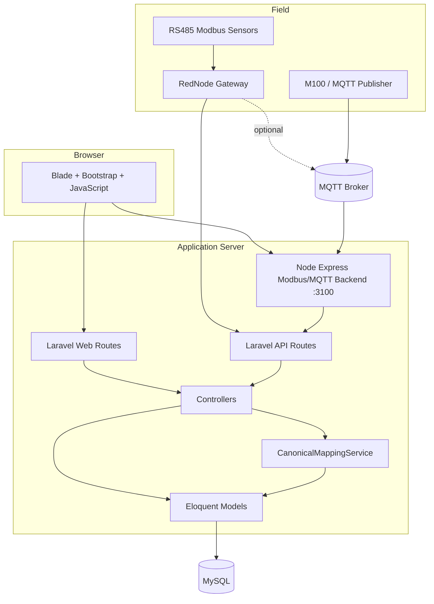
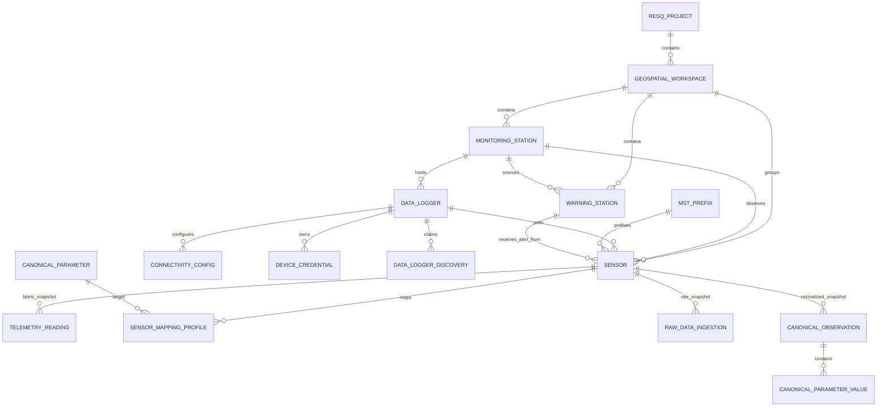
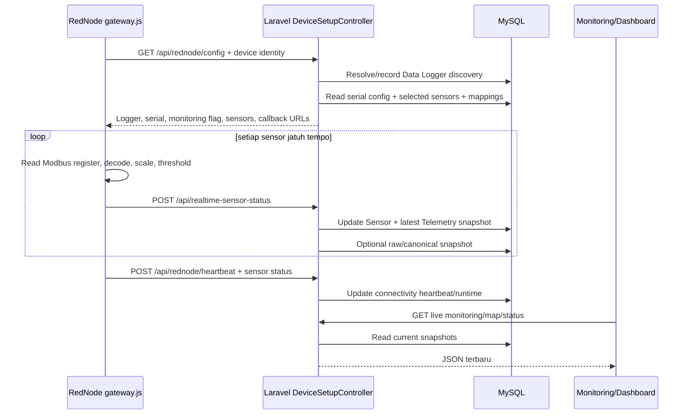
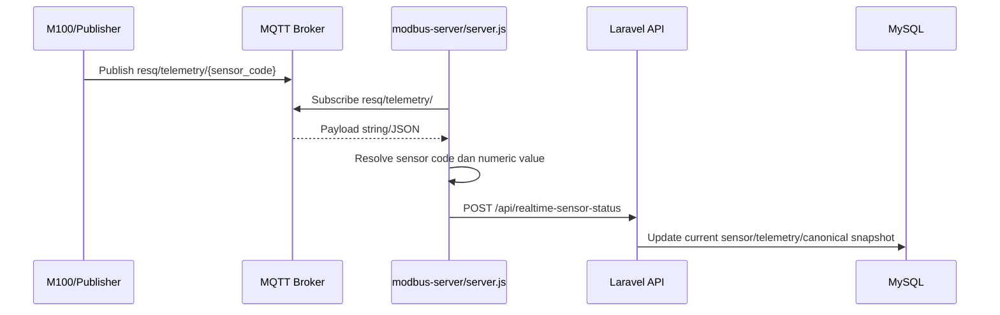

# Arsitektur dan Model Data

Dokumen ini menjelaskan bagaimana source code dibagi, bagaimana request bergerak, dan bagaimana tabel saling terhubung. Gunakan dokumen ini sebelum memutuskan file mana yang harus diubah.

## 1. Gaya arsitektur saat ini

Aplikasi memakai monolit Laravel server-rendered dengan dua proses integrasi Node.js di luar proses PHP:



Karakter utama implementasinya:

- Controller cukup besar dan melakukan validation, orchestration, query, mapping view, network scan, serta SSH.
- Eloquent model berisi fillable/cast/relation, belum memakai domain behavior yang tebal.
- `CanonicalMappingService` adalah service domain khusus yang paling jelas batas tanggung jawabnya.
- Frontend module menggunakan Blade dan inline JavaScript; belum berupa SPA/component framework.
- Queue dan scheduler tersedia dari Laravel tetapi belum dipakai untuk flow telemetry.
- Telemetry dan canonical runtime diperlakukan sebagai **current snapshot**, bukan time-series history.

## 2. Struktur repository yang relevan

```text
early-warning-system/
├── app/
│   ├── Http/Controllers/        # Web/API orchestration
│   ├── Http/Middleware/         # Auth, CSRF, localization, dll.
│   ├── Models/                  # Eloquent model dan relasi
│   ├── Services/
│   │   └── CanonicalMappingService.php
│   └── Providers/               # Route dan rate limiting
├── config/
│   ├── resq_dummy.php           # Fallback dashboard sebelum tabel ada
│   └── indonesia.php            # Daftar provinsi fallback
├── database/
│   ├── migrations/              # Evolusi skema
│   ├── seeders/                 # Admin, customer, canonical parameter
│   └── database.sqlite          # File tersedia, bukan DB default
├── docs/                        # Dokumentasi project
├── modbus-server/
│   ├── server.js                # Express Modbus TCP + MQTT adapter
│   ├── gateway.js               # Gateway serial generasi awal/legacy
│   └── scan-registers.js        # Utilitas scan register
├── rednode-gateway/
│   ├── gateway.js               # Gateway perangkat utama
│   ├── test-pin-led.js
│   └── test-ports.js
├── resources/
│   ├── views/modules/           # Halaman domain RESQ
│   ├── views/layouts/           # Master, sidebar, topbar
│   ├── js, scss, libs, images/  # Source/static assets
│   └── views/*.blade.php        # Banyak halaman bawaan template Skote
├── routes/
│   ├── web.php
│   └── api.php
├── tests/                       # PHPUnit; masih sangat minimal
├── .env.example
├── composer.json
├── package.json
└── vite.config.js
```

Jangan menganggap semua file di `resources/views/` sebagai fitur RESQ. Banyak file root adalah demo template Skote yang dapat diakses melalui catch-all bila nama view cocok. Fitur domain utama berada di `resources/views/modules/`.

## 3. Tanggung jawab controller

| Controller | Tanggung jawab aktif |
|---|---|
| `DashboardController` | Dashboard, peta JSON, status bahaya, dummy fallback |
| `ProjectSetupController` | CRUD konfigurasi project/workspace/station/sensor/response plan dan data untuk halaman Project Setup |
| `DeviceSetupController` | CRUD device, telemetry ingest, RedNode config/heartbeat/status/control, SSH, scan LAN/pin/port |
| `CanonicalDatabaseController` | CRUD master canonical parameter dan mapping profile, latest observation |
| `RegisteredDataController` | Menyusun data registry untuk halaman Registered/Device/Telemetry |
| `PublicTelemetryController` | Read API latest sensor/project untuk consumer eksternal |
| `HomeController` | Catch-all view template, localization, update profile/password |
| Controller Auth Laravel UI | Login/register/verification/reset password |

Catatan penting:

- `ProjectSetupController` mempunyai method `startMonitoring`, `stopMonitoring`, dan `liveMonitoring`, tetapi route project monitoring aktif mengarah ke method berbeda di `DeviceSetupController`.
- `ProjectSetupController::viewData()` dan `RegisteredDataController::data()` memiliki banyak transformasi yang mirip. Perubahan field sering perlu dilakukan di kedua tempat sampai kode ini direfaktor.

## 4. Request lifecycle

### Web

```text
Browser
→ routes/web.php
→ middleware group web (cookie, session, CSRF, localization)
→ middleware auth pada route utama
→ Controller
→ validation + Eloquent
→ Blade response atau JSON
```

Mayoritas route domain berada dalam `Route::middleware('auth')`. Beberapa route lama berada di luar group, termasuk customer, update profile/password, language, dan catch-all view. Bagian ini perlu audit keamanan tersendiri.

### API

```text
Device/consumer
→ /api/*
→ middleware group api
→ rate limiter
→ optional custom bearer-token check di controller
→ validation
→ Eloquent/service
→ JSON
```

Rate limit:

- RedNode dan realtime ingest: 1.200 request/menit per IP.
- API lain: 60 request/menit per user atau IP.

Endpoint device tidak memakai Sanctum; ia memakai bearer token environment yang diperiksa manual. Bila environment token kosong, pemeriksaan menjadi terbuka.

## 5. Model domain dan relasi



### Hirarki konfigurasi

```text
Project
└── Geospatial Workspace
    ├── Monitoring Station
    │   ├── Data Logger
    │   │   ├── Connectivity Config
    │   │   └── Device Credential
    │   └── Sensor
    ├── Warning Station
    └── Response Plan
```

Sensor memiliki foreign key langsung ke workspace dan monitoring station, optional Data Logger/warning station, serta prefix. Karena ada beberapa jalur relasi, konsistensi harus dijaga oleh form/service; database tidak memastikan semua record tersebut berasal dari project/workspace yang sama.

## 6. Data dictionary ringkas

### Konfigurasi project

| Tabel | Model | Kunci/isi penting | Delete behavior |
|---|---|---|---|
| `resq_projects` | `Project` | `project_code` unik, nama, owner, status | Workspace cascade |
| `geospatial_workspaces` | `GeospatialWorkspace` | project, code unik, hazard, lokasi, status | Station/sensor terkait cascade melalui FK masing-masing |
| `monitoring_stations` | `MonitoringStation` | workspace, code unik, koordinat, legacy logger fields | Sensor cascade; warning source null; logger station null |
| `warning_stations` | `WarningStation` | workspace/source station, controller/output/status | Sensor reference null |
| `sensors` | `Sensor` | station/logger, addressing, decoding, threshold, current value/status | Telemetry cascade; mapping/raw/canonical sebagian null/delete cleanup |
| `response_plans` | `ResponsePlan` | target optional dan flag notif/SMS/warning | FK target menjadi null |
| `provinces` | `Province` | nama dan koordinat fallback | Dipakai untuk peta/geospatial fallback |

### Perangkat dan runtime

| Tabel | Model | Fungsi |
|---|---|---|
| `mst_prefixes` | `MstPrefix` | Namespace/pengelompokan addressing sensor |
| `data_loggers` | `DataLogger` | Identity logger, station, remote SSH dan health terakhir |
| `data_logger_discoveries` | `DataLoggerDiscovery` | Identity gateway yang terdeteksi serta link hasil claim |
| `connectivity_configs` | `ConnectivityConfig` | Network/serial config, selected sensors, heartbeat, runtime state |
| `device_credentials` | `DeviceCredential` | Token/username/password reference device/MQTT |
| `telemetry_readings` | `TelemetryReading` | Snapshot pembacaan operasional terakhir per sensor |

Field penting `connectivity_configs`:

- transport generik: `communication_type`, `protocol`, `host_or_endpoint`, `port`, `topic_or_api_path`;
- serial: `serial_port`, `baud_rate`, `data_bits`, `stop_bits`, `parity`, `timeout_ms`, `pin_mapping`;
- pilihan runtime: `monitored_sensor_ids`, `rednode_poll_interval_ms`;
- remote control lama: `rednode_host`, `rednode_ssh_*`, `rednode_gateway_path`;
- state: `connectivity_status`, `last_seen_at`, `last_error`, `last_payload`, `serial_settings`, `runtime_state`.

Implementasi baru lebih banyak mengambil SSH dari `data_loggers.remote_*`, sedangkan field `rednode_*` pada connectivity masih ada untuk kompatibilitas. Saat menambah fitur, cek kedua jalur sebelum menghapus salah satunya.

### Canonical database

| Tabel | Model | Fungsi |
|---|---|---|
| `raw_data_ingestions` | `RawDataIngestion` | Raw value/payload dan metadata akuisisi |
| `canonical_parameters` | `CanonicalParameter` | Definisi field/unit baku per domain |
| `sensor_mapping_profiles` | `SensorMappingProfile` | Mapping sensor/register vendor ke canonical parameter |
| `canonical_observations` | `CanonicalObservation` | Observation baku per sensor/domain |
| `canonical_parameter_values` | `CanonicalParameterValue` | Nilai numerik/string per canonical parameter |

Domain canonical yang diizinkan skema/controller:

- `meteorology`;
- `hydrology`;
- `geotechnical`.

## 7. Alur telemetry end-to-end

### Jalur RedNode/Modbus RTU



### Jalur MQTT



MQTT parser menerima:

- `sensor_code`, `sensorCode`, atau `code` dalam JSON;
- fallback segmen topic terakhir;
- value dari `value`, `reading`, `data`, `payload`, atau property pertama;
- payload scalar/string bila bukan JSON.

## 8. Transformasi nilai

Ada dua tingkat decoding/transformasi:

### Gateway

Gateway RedNode:

1. membaca coils/register sesuai function code;
2. menggabungkan register sesuai data type;
3. menerapkan `sensor.scale_factor` dan `sensor.offset`;
4. menambahkan unit untuk display;
5. menghitung `value > threshold`.

Untuk weather station, setiap register dipetakan ke satu weather parameter dan memakai scale/offset yang sama.

### Canonical service

`CanonicalMappingService`:

1. memilih mapping profile aktif terbaru;
2. mengambil angka pertama dari raw input;
3. menerapkan scale/offset milik mapping profile;
4. menyimpan source traceability;
5. menghasilkan canonical value/unit.

Pastikan contract gateway mengirim `raw_value` bila canonical profile memakai transformasi. Bila gateway sudah mengirim nilai yang telah diskalakan sebagai `value` dan mapping kembali memakai scale/offset, transformasi dapat diterapkan dua kali. Ini dibahas sebagai utang teknis di dokumen operasional.

## 9. Semantik snapshot, bukan histori

Method `upsertTelemetryReading()` mencari reading terbaru untuk sensor, memperbaruinya, lalu menghapus reading lain milik sensor tersebut. Efeknya:

```text
1 sensor → maksimal 1 telemetry_readings aktif
```

Canonical service juga memperbarui latest raw ingestion/observation untuk scope sensor/profile lalu membersihkan duplikat. Konsekuensi:

- query “latest” cepat dan tabel kecil;
- tidak ada trend historis/audit lengkap;
- `received_at` lama akan hilang saat snapshot ditimpa;
- alert sebelumnya tidak dapat direkonstruksi hanya dari database ini.

Jika produk memerlukan chart historis, SLA, audit bencana, replay, atau analitik, jangan sekadar menghapus cleanup. Rancang tabel append-only/time-series, retention, index, idempotency key, dan jalur agregasi terlebih dahulu.

## 10. Evaluasi alert

Pada ingest otomatis:

```php
$numericValue > $numericThreshold
```

Angka diambil dari angka pertama pada string. Contoh:

| Value | Threshold | Hasil implementasi |
|---|---|---|
| `120 cm` | `> 100 cm` | Awas |
| `100` | `>= 100` | Normal, karena kode tetap memakai `>` |
| `20` | `< 30` | Normal, operator `<` diabaikan |
| `MMI VI` | `>= MMI V` | Tidak dapat dievaluasi numerik |

Dashboard menganggap `Danger`, `Bahaya`, `Awas`, atau `Siaga` sebagai danger status. `Waspada` tidak masuk daftar danger dashboard saat ini.

## 11. Freshness dan online state

Konsep yang berbeda:

- **Reading fresh**: `received_at` lebih baru dari `now - PROJECT_MONITORING_FRESH_SECONDS` (default 90 detik).
- **Logger online di project monitoring**: connectivity heartbeat fresh dan status `Online`.
- **RedNode status online**: heartbeat sekitar 45 detik dan status `Online`.
- **Dashboard danger**: memakai latest snapshot/status dan tidak selalu menolak alert hanya karena data sudah lama.

Hindari memakai satu label “online” untuk semua kebutuhan. Dalam fitur baru, tentukan apakah yang dimaksud proses gateway hidup, serial connected, reading fresh, atau device remote reachable.

## 12. Batas komponen Node.js

### `modbus-server/server.js`

Express server port default `3100` untuk:

- connect/disconnect/read/write Modbus TCP;
- start/stop satu poll job in-memory;
- connect/disconnect/test MQTT;
- subscribe MQTT dan callback ke Laravel;
- health dan stats in-memory.

Ini terutama backend halaman **Modbus Configuration** dan MQTT adapter di server/laptop. State hilang saat proses restart. Endpoint-nya tidak memiliki auth internal.

### `modbus-server/gateway.js`

Gateway serial generasi awal. Ia mengambil RedNode config, polling serial, optional MQTT, callback, dan heartbeat, tetapi identity default lebih statis. `npm run gateway` di root mengarah ke file ini.

### `rednode-gateway/gateway.js`

Gateway yang direkomendasikan untuk paket yang dipasang pada RedNode/Bliiot. Tambahan penting:

- stable device UID;
- serial number, hostname, OS/gateway version, MAC address;
- discovery/claim yang lebih aman untuk multi logger;
- argumen `--logger-code`;
- default refresh/heartbeat lebih cepat.

`npm run rednode:gateway` dari root atau `npm run gateway` di folder `rednode-gateway/` menjalankan file ini.

Jangan menjalankan dua gateway untuk serial port/logger yang sama karena keduanya dapat berebut port dan mengirim telemetry ganda.

## 13. Frontend dan aset

Halaman domain memakai:

```text
resources/views/layouts/master.blade.php
├── topbar
├── sidebar
├── @yield(content)
└── vendor scripts
```

Module Blade sering memuat CSS dan JavaScript inline. Contoh Modbus Configuration memiliki state browser, fetch ke backend Node, fetch ke Laravel, timer status, dan table renderer dalam satu file besar. Saat mengubahnya:

- jangan berasumsi `resources/js` memuat semua logic;
- cari inline `<script>` di Blade;
- bersihkan timer ketika flow halaman berubah;
- gunakan route helper untuk URL Laravel;
- pastikan CSRF header/token ada untuk web POST;
- bedakan base URL Laravel dan base URL backend Node.

## 14. Dummy dan fallback data

`config/resq_dummy.php` digunakan bila tabel project belum ada. Fallback lain di `RegisteredDataController` dapat membentuk logger/connectivity/credential dari monitoring station lama bila tabel device tidak tersedia.

Fallback membantu UI tetap render selama migrasi evolutif, tetapi juga bisa menyamarkan deployment rusak. Pada production lakukan health check terhadap migrasi, bukan hanya HTTP 200 dashboard.

## 15. Sumber kebenaran per perubahan

| Jenis perubahan | File pertama yang diperiksa | File lain yang biasanya ikut berubah |
|---|---|---|
| Route/endpoint | `routes/web.php` atau `routes/api.php` | Controller, test, docs |
| Field database | migration baru | Model fillable/casts, validation, query projection, Blade, test |
| Sensor config | `ProjectSetupController::storeSensor` | `Sensor`, project view, RedNode config, gateway decoder |
| Telemetry payload | `DeviceSetupController::updateRealtimeSensorStatus` | Node gateway, public API, tests |
| Canonical mapping | `CanonicalMappingService` | mapping controller/view, seeder, tests |
| Live monitoring | `DeviceSetupController::projectMonitoringLiveData` | monitoring Blade, freshness config |
| Dashboard alert/map | `DashboardController` | dashboard Blade/JavaScript |
| RedNode runtime | `DeviceSetupController` + `rednode-gateway/gateway.js` | `.env.example`, service config, operational docs |

Lanjutkan ke [Panduan Pengembangan dan Referensi API](03-PENGEMBANGAN-DAN-API.md).
